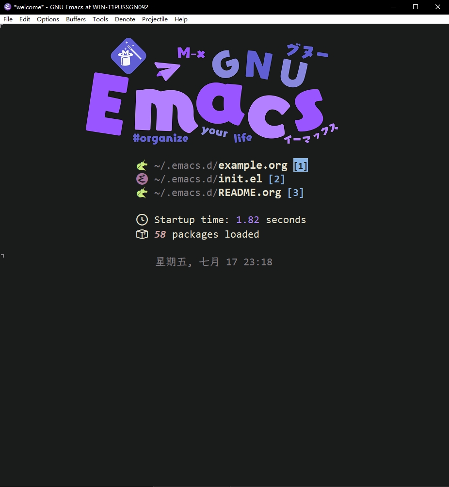
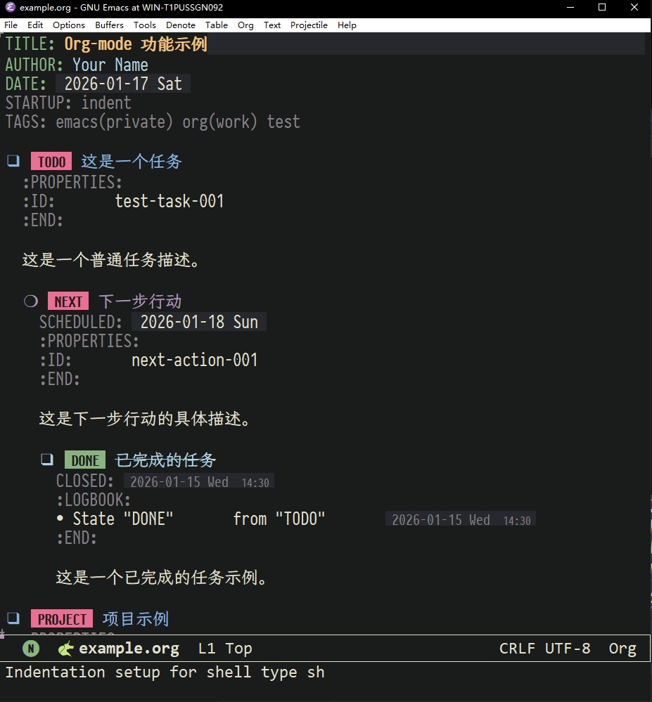

# Windows Emacs Org-mode 配置

&gt; 基于 [LuciusChen/.emacs.d](https://github.com/LuciusChen/.emacs.d) 改造，适配 Windows 10 环境。

## 简介

本配置 fork 自 LuciusChen 的 Emacs 配置，经大幅精简后专注于 **Org-mode 笔记与任务管理**。删除了原配置中绝大多数面向 macOS / Linux 的特性（输入法补丁、LaTeX 编译链、IDE 集成等），保留并完善了 Org-mode 核心功能，使其在 Windows 10 上开箱即用。

## 与原配置的主要差异

| 项目 | 原配置 | 本配置 |
|------|--------|--------|
| 目标平台 | macOS / Arch Linux | **Windows 10** |
| 功能范围 | 全功能（编程、Git、翻译、社交等） | **精简至 Org-mode 核心** |
| 包管理 | straight.el + 大量自定义包 | 仅保留 Org 生态必需包 |
| 编译依赖 | 需自行编译 Emacs + 打补丁 | 使用 Windows 预编译版 |

## 保留的 Org-mode 功能

- **任务管理**：TODO / NEXT / WAITING / DELEGATED 状态流转
- **Agenda 视图**：自定义 GTD 看板（Next Actions / Projects / Waiting / On Hold）
- **日记系统**：基于 denote-journal 的每日捕获模板
- **时钟记录**：org-clock 工作时长追踪
- **Babel 支持**：PlantUML / Python / Shell / SQL / LaTeX 代码块
- **中文优化**：LXGW WenKai Screen 中文字体 + 视觉对齐

## 字体配置

- 西文字体：Consolas + PragmataPro（Org-mode）
- 中文字体：LXGW WenKai Screen
- 符号 fallback：Jigmo 系列（CJK 全覆盖）

## 截图

### Emacs 启动页面

### Org-mode 笔记与任务管理

## 安装

1. 安装 [Emacs for Windows](https://www.gnu.org/software/emacs/download.html)
2. 将本仓库克隆至 `~/.emacs.d`（即 `C:\Users\&lt;用户名&gt;\AppData\Roaming\.emacs.d`）
3. 启动 Emacs，等待包自动安装

## 致谢

- [LuciusChen](https://github.com/LuciusChen) — 原配置作者
- [Org mode](https://orgmode.org/) — 最强大的纯文本笔记系统